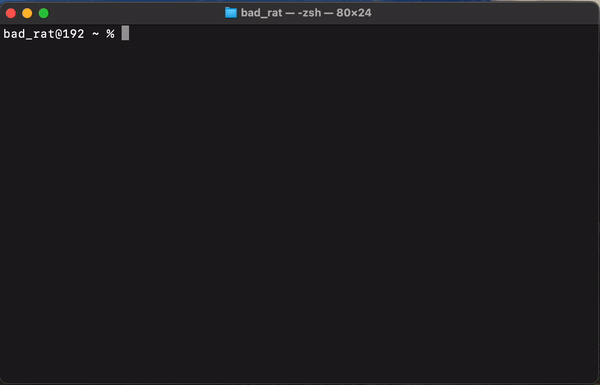

# zsh-interactive-cd

## Overview

**zsh-interactive-cd** is a plugin designed to enhance the 'cd' command in Zsh with interactive features, making directory navigation faster and more intuitive.

## Features

- Interactive directory navigation
- Autocomplete suggestions for directories
- Quick access to frequently visited directories

## Installation

### Using Git

1. Clone the repository:
```sh
git clone https://github.com/BadRat-in/zsh-intractive-cd.git ~/.zsh/zsh-interactive-cd
```

2. Add the following line to your `.zshrc` file:
```sh
source ~/.zsh/zsh-interactive-cd/zsh-interactive-cd.plugin.zsh
```

3. Reload your `.zshrc` file to apply the changes:
```sh
source ~/.zshrc
```

## Usage

After installation, the enhanced `cd` command will be available in your Zsh shell. Simply use `cd` as you normally would, and enjoy the interactive features and autocomplete suggestions for directories.

## Demo



## License

This project is licensed under the Mozilla Public License 2.0. See the [LICENSE](LICENSE) file for details.
